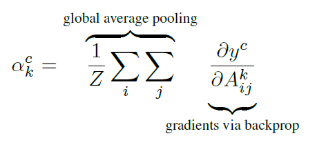

![Made-love][made-love-shield]
[![LinkedIn][linkedin-shield]][linkedin-url]

# Gradcam_tensorflow
Own implementation of GradCAM algorithm in Tensorflow 2.x

Based on GradCAM implementation by Adrien Rosebrock in his blog [PyImageSearch][pyimgsearch-url], but with minor changes listed below to improve its performance

* Change activation layer: If the last dense layer of the network has a softmax activation, it will be substituted by a linear activation. As it is mentioned in the original paper, we want to compute the gradient of
the score for class c (before the softmax) with respect to
feature map activations Ak of a convolutional layer. 



The outputs after softmax will not be independent between them, because softmax scales outputs to obtain that the sum of all outputs is equal to 1. Therefore, we will watch at logits(unscaled outputs)

```
config = model.layers[-1].get_config()
weights = [x.numpy() for x in model.layers[-1].weights]

config['activation'] = linear
config['name'] = 'logits'

new_layer = Dense(**config)(model.layers[-2].output)
new_model = Model(inputs=[model.input], outputs=[new_layer])
new_model.layers[-1].set_weights(weights)

new_config = new_model.layers[-1].get_config()
return new_model
```

* Updated to deal with binary / categorical classification

```
if len(predictions)==1:
    # Binary
    loss = predictions[0]
else:
    # Categorical 
    loss = predictions[:, self.classIdx]
```

* Added tape.watch of the outputs of the selected layer

```
tape.watch(self.gradModel.get_layer(self.layerName).output)
```

## Description
Gradient-weighted Class Activation Mapping (GradCAM) is a technique for visualizing the regions of the image that are “important” for predictions from CNN models. In other words, it allows the user to check what CNN is looking at inside the image.

Grad-CAM uses the class-specific gradient information flowing into the final convolutional layer of a CNN to produce a coarse localization map of the important regions in the image.

![Network][network-screenshot]


## Requirements
* Tensorflow 2.x
* OpenCV

## Contact
* [@davertor](https://github.com/davertor) 

<!-- MARKDOWN LINKS & IMAGES -->
<!-- https://www.markdownguide.org/basic-syntax/#reference-style-links -->

[network-screenshot]: images/network.png
[gradient-screenshot]: images/gradients.png
[linkedin-url]: https://linkedin.com/daniel-verdu-torres
[pyimgsearch-url]: https://www.pyimagesearch.com/2020/03/09/grad-cam-visualize-class-activation-maps-with-keras-tensorflow-and-deep-learning/

[made-love-shield]: https://img.shields.io/badge/-Made%20with%20love%20❤️-orange.svg?style=for-the-badge
[license-shield]: https://img.shields.io/badge/License-GNU-brightgreen.svg?style=for-the-badge
[linkedin-shield]: https://img.shields.io/badge/-LinkedIn-darkblue.svg?style=for-the-badge&logo=linkedin
[twitter-shield]: https://img.shields.io/badge/-Twitter-blue.svg?style=for-the-badge&logo=twitter


